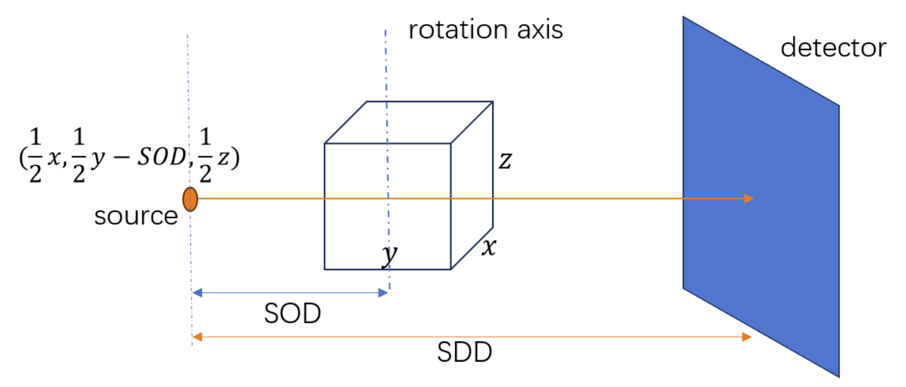

# 蒙卡模拟

---

## 1、环境搭建
### 蒙卡程序环境
项目基于原版MC-GPU v1.5程序执行模拟（原名称为：VICTRE_MCGPU），该版本可以实现对滤线栅的添加，多GPU并行执行，对于该项目，需要利用该版本在内存中使用二叉树结构存储的vox模体以节省内存

具体配置方法和执行方法参考原作者GitHub仓库，需要注意使用**低于**12的CUDA版本（对于高版本的支持情况未知），前期实验平台使用的CUDA版本为11.8
<https://github.com/DIDSR/VICTRE_MCGPU>

---

## 2、体模文件编写
代码参考 *rawForMcCreate.py* 

需要注意，为了配合MCGPU的射线方向（默认）为从Y轴负方向到正方向，因此体模在编写时将Y轴作为（pmma）厚度方向以方便MC-GPU的几何设置

* 输出二进制 .raw.gz（MC-GPU 能直接读取）
* 密度不写入文件——在MCGPU配置文件 .in 的 [SECTION MATERIAL FILE LIST] 内用 density= 覆盖即可
* CO₂ 方块位于 PMMA 板内部
该版本的MCGPU需要在配置文件中提供体模的大小和材料密度等信息，故代码同时输出相关参数，详细配置将在下文详述

---

## 3、几何设置和MC-GPU配置文件设置
.in配置参考文件 *MC-GPU_sample.in*  
### 几何设置

`10  -50   10     # SOURCE POSITION: X (chest-to-nipple), Y (right-to-left), Z (caudal-to-cranial) [cm]`
坐标原点为体模文件的左后下面，因此射线源的位置居中设置应为（ 1/2*X , 1/2*Y-SOD , 1/2*Z ）  
### 配置文件设置
*配置文件中有许多“无用”参数，设为0或-1或关闭即可*  

GPU设置为-1可使用多GPU运行  
`-1  # GPU NUMBER TO USE WHEN MPI IS NOT USED, OR TO BE AVOIDED IN MPI RUNS`  
滤线栅设置  

    13   90.55   0.00254    # ANTISCATTER GRID RATIO, FREQUENCY, STRIP THICKNESS [X:1, lp/cm, cm] (enter 0 to disable the grid)
    0.0157   1.2521          # ==> MFP(lead&polystyrene,19keV)  # ANTISCATTER STRIPS AND INTERSPACE MEAN FREE PATHS AT AVERAGE ENERGY [cm]
兴趣范围（覆盖目标即可）

    1 1280                        # VOXEL DOSE ROI: X-index min max (first voxel has index 1)
    1 1950                        # VOXEL DOSE ROI: Y-index min max
    470  470                      # VOXEL DOSE ROI: Z-index min max
vox部分，需要填写体素的大小，体模的大小，否则程序报错，因此批量运行时，需要通过python脚本修改这部分的内容

    #[SECTION VOXELIZED GEOMETRY FILE v.2017-07-26]
     phantom/PMMA100px_muti_200x150x200.raw.gz    # VOXEL GEOMETRY FILE (penEasy 2008 format; .gz accepted)
     0.0    0.0    0.0              # OFFSET OF THE VOXEL GEOMETRY (DEFAULT ORIGIN AT LOWER BACK CORNER) [cm]
     200   150   200              # NUMBER OF VOXELS: INPUT A 0 TO READ ASCII FORMAT WITH HEADER SECTION, RAW VOXELS WILL BE READ OTHERWISE
     0.1 0.1 0.1           # VOXEL SIZES [cm]
     1 1 1                          # SIZE OF LOW RESOLUTION VOXELS THAT WILL BE DESCRIBED BY A BINARY TREE, GIVEN AS POWERS OF TWO (eg, 2 2 3 = 2^2x2^2x2^3 = 128 input voxels per low res voxel; 0 0 0 disables tree)

材料文件和密度设置，voxelId需要和raw文件一一对应，因为使用材料近似代替，密度设置对于每个能谱文件，都需要进行一次矫正调整，具体见下文单独模块  

        #[SECTION MATERIAL FILE LIST v.2020-03-03]
        #  -- Input material file names first, then material density after keyword 'density=' (optional if using nominal density), then comma-separated list of voxel ID numbers after keyword 'voxelID=' (empty if material not used).
        /mnt/no2/huzhen/material/air__5-120keV.mcgpu.gz                  density=0.00120479   voxelId=1
        /mnt/no2/huzhen/material/PMMA__5-120keV.mcgpu.gz                 density=1.18         voxelId=2  

---

## 材料密度设置
原实验方案中，许多模拟材料在MC-GPU程序缺失，因此项目后续采用近似材料代替的方案，通过mgfpj程序测的基准数据，再通过调节MC-GPU中的材料密度来实现材料的代替  
具体代替如下  

    Iodine    ->  Se
    Fe        ->  Steel
    Ta,Pt,Ba  ->  W
    Co2       ->  Air
具体步骤如下：  

* 通过CreateRawForFpj文件夹中的代码，生成对应材料的raw文件
* 通过fpj文件夹中的代码，使用mgfpj程序对该材料的raw执行正投影
* 对于得到的正投影图像（路径积分），通过fpjCalculation.py程序，计算对应能谱下衰减积分的值，得到对应的postlog图像
* 通过比对mgfpj和MCGPU中，相同材料的读数差异，调整对应材料的密度大小（建议使用系数而非直接修改密度）

## 能谱来源和设置
所需的能谱文件由此网站获得  
<https://bps.healthcare.siemens-healthineers.com/booneweb/index.html>  
得到的CSV文件可由csvToTxt.py和txtToSpec.py转换为所需的格式

## 部分脚本文件说明
primaryToPostlog.py 将MCGPU图像转换为Postlog图，空气图可以通过直接拉高探测器Z轴来拍摄获得  
mcgpuProcces.py 批量运行脚本，适用于修改后的v1.5b程序，配置文件与原版不同，仅供参考

